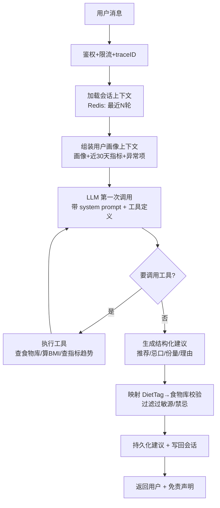

# 健康管理 Agent — 技术设计文档

> 版本：v0.1（框架设计稿）
> 目标：生产级 Golang 后端，围绕「用户健康画像 + 对话」给出**当天饮食建议**。
> 定位：一个带记忆、带工具调用的 LLM Agent，核心难点不在 AI，而在**领域数据建模 + 一致性 + 安全合规 + 高并发**——这正是后端的主场。

---

## 1. 产品目标与边界

### 1.1 一句话定义
用户把自己的身体信息（身高/体重/体脂率/体检记录）交给系统，通过多轮对话，系统结合**个人画像 + 当天上下文（今天运动了没、昨天吃了啥、最近血糖血脂）**，给出「今天适合吃什么」的建议。

### 1.2 核心用例
1. 录入/更新个人身体指标（身高、体重、体脂率、腰围等）。
2. 上传/录入医院体检记录（血糖、血脂、尿酸、肝肾功能等关键指标）。
3. 自然语言对话："我今天该吃啥？""我血糖有点高能吃米饭吗？"
4. 系统输出结构化饮食建议（推荐/忌口/份量/理由），并能追问澄清。

### 1.3 明确的非目标（划边界，避免过度设计 & 合规风险）
- **不做医疗诊断、不开处方**。定位是「营养/饮食生活方式建议」，不替代医生。所有输出带免责声明。
- 不做食物图像识别（v1 先文字，图像识别是后续可插拔模块）。
- 不做可穿戴设备实时接入（v1 手动录入，预留 ingest 接口）。

> ⚠️ **合规红线**：涉及个人健康数据（PHI）。设计从第一天就要考虑**数据加密、脱敏、访问审计、可删除（被遗忘权）**。这是这个项目跟 emotional-rag-agent 最大的不同——后者是玩具级单用户，这个是多用户 + 敏感数据。

---

## 2. 领域模型（DDD 分层的核心）

健康数据的特点：**指标随时间变化、来源不同、可信度不同**。所以模型设计要抓住「时间序列」和「快照」两个概念。

### 2.1 核心聚合

```
User (用户聚合根)
 ├── Profile        个人基础画像（相对静态：性别、出生日期、身高、过敏源、饮食偏好、疾病史标记）
 ├── BodyMetric[]   身体指标时间序列（体重、体脂率、腰围…每次测量一条，带 measured_at）
 ├── MedicalRecord[]体检记录（一次体检 = 一条记录，内含多个 LabResult）
 │     └── LabResult[]  单项检验值（血糖 6.2 mmol/L，参考区间，是否异常）
 └── DietAdvice[]   历史饮食建议（可追溯：当时基于哪些指标给的建议）
```

### 2.2 为什么身体指标要做成时间序列而不是 Profile 上的字段？
- 体重/体脂率是**会变的**，饮食建议的价值恰恰在「趋势」（最近一个月胖了 3kg vs 稳定）。
- 单值字段会丢失历史，无法做趋势分析，也无法回溯「上次建议基于什么数据」。
- 这是典型的**事件/快照建模**思路，跟你项目里状态机/流水的思路一脉相承。

### 2.3 关键值对象
- `LabResult`：`{ item_code, value, unit, ref_low, ref_high, abnormal_flag }`。异常判定在录入时算好并落库（读多写少，避免每次查询重算）。
- `DietTag`：结构化标签体系（如 `low_gi`、`high_protein`、`low_purine`、`avoid_alcohol`），LLM 输出映射到标签，标签再映射到食物库——**降低 LLM 幻觉风险的关键设计**。

---

## 3. 系统架构

### 3.1 分层（Clean Architecture / 六边形）

```
┌─────────────────────────────────────────────────────────┐
│  interface 层  (HTTP handler / WebSocket / gRPC)          │  ← 协议、鉴权、限流、参数校验
├─────────────────────────────────────────────────────────┤
│  application 层 (用例编排 UseCase / Service)              │  ← 事务边界、Agent 编排、调用 domain + infra
├─────────────────────────────────────────────────────────┤
│  domain 层    (实体/值对象/领域服务/repository 接口)      │  ← 纯业务规则，无框架依赖，可单测
├─────────────────────────────────────────────────────────┤
│  infrastructure 层 (MySQL / Redis / LLM / 向量库 / MQ)   │  ← repository 实现、外部适配器（防腐层）
└─────────────────────────────────────────────────────────┘
```

**核心原则**：domain 层不 import 任何外部框架（不认识 gin、gorm、openai）。LLM 客户端、数据库都通过接口注入——这样 domain 可以纯单测，也方便你练「面试常考的防腐层/适配器」。

### 3.2 目录结构（Go 项目标准布局）

```
healthAgent/
├── cmd/
│   └── server/
│       └── main.go              # 入口：装配依赖、启动 HTTP、优雅关闭
├── internal/
│   ├── config/                  # 配置加载（yaml + env，敏感项走 env）
│   ├── domain/                  # ⭐ 领域层（纯业务）
│   │   ├── user/                #   Profile / BodyMetric 实体 + repo 接口
│   │   ├── medical/             #   MedicalRecord / LabResult
│   │   ├── diet/                #   DietAdvice / DietTag / 食物库
│   │   └── errs/                #   领域错误（sentinel error）
│   ├── application/             # ⭐ 用例编排层
│   │   ├── profile_service.go   #   录入/更新画像
│   │   ├── medical_service.go   #   录入体检记录
│   │   └── advisor/             #   ⭐⭐ Agent 核心：饮食建议编排
│   │       ├── agent.go         #     对话循环 + 工具调用 loop
│   │       ├── context.go       #     组装用户上下文（画像+近期指标+对话）
│   │       └── tools.go         #     工具定义（查指标/查食物库/算BMI…）
│   ├── infrastructure/
│   │   ├── persistence/         #   repo 实现（MySQL）
│   │   ├── cache/               #   Redis（会话、热点画像）
│   │   ├── llm/                 #   LLM 适配器（openai 兼容，可换模型）
│   │   ├── vector/              #   向量检索（食物库/知识库 RAG，可选）
│   │   └── crypto/              #   字段级加密（PHI 敏感数据）
│   ├── interface/
│   │   └── http/
│   │       ├── handler/         #   各 endpoint
│   │       ├── middleware/      #   鉴权 / traceID / 限流 / recover / 审计
│   │       └── dto/             #   请求响应结构 + 校验
│   └── pkg/                     # 内部通用工具（logger、response、idgen）
├── migrations/                  # 数据库迁移 SQL
├── config.yaml
├── go.mod
└── docs/
```

> 对比 emotional-rag-agent：那个是扁平单 package，这个是分层多 package。原因就是**多用户 + 敏感数据 + 团队协作**要求边界清晰、可测试、可审计。

---

## 4. Agent 核心：怎么从对话到饮食建议

这是整个系统的心脏。分两层讲：**Demo 实现层** 和 **生产演进层**。

### 4.1 处理流水线（一次对话请求）



### 4.2 降低 LLM 幻觉的关键设计（生产级重点）
LLM 直接说"你可以吃 XX"是危险的（可能推荐过敏食物、跟疾病冲突）。所以：
1. **约束输出为结构化标签**：LLM 只输出 `DietTag`（low_gi / high_protein…）+ 推荐食物候选，不让它自由发挥份量数字。
2. **规则引擎兜底校验**：拿到 LLM 建议后，用**确定性规则**过一遍——过敏源直接剔除、疾病禁忌（如痛风忌高嘌呤）强制过滤。规则是硬编码的领域知识，不信任 LLM。
3. **食物库作为 ground truth**：推荐必须落在食物库里（带营养成分），LLM 编造的食物直接丢弃。
4. **RAG 增强（可选）**：把权威营养知识/膳食指南做成向量库，检索后喂给 LLM，减少胡说。

> 这条「LLM 生成 + 规则引擎校验」的双层结构，就是把不可信的 AI 输出用可信的后端逻辑兜住——面试讲这个比讲"我调了个 GPT"值钱得多。

### 4.3 上下文组装（Context Engineering）
每次请求喂给 LLM 的上下文 = 
`系统 prompt（角色+安全约束）` + `用户画像摘要` + `近期异常指标` + `饮食偏好/过敏源` + `最近 N 轮对话`。
- **摘要而非全量**：体检记录可能几十项，只挑异常项 + 相关项喂进去（省 token、聚焦）。
- 画像摘要可缓存（Redis），指标变化时失效。

---

## 5. 数据存储设计

### 5.1 选型
| 数据 | 存储 | 理由 |
|---|---|---|
| 画像 / 体检 / 建议 | MySQL | 结构化、事务、可审计 |
| 会话上下文 | Redis | 多轮对话短期记忆，TTL 过期 |
| 热点画像摘要 | Redis | 读多写少，降 DB 压力 |
| 食物库/营养知识 | MySQL + 向量库 | 结构化查询 + 语义检索 |

### 5.2 敏感数据处理（PHI 合规）
- **字段级加密**：体检数值、疾病史等敏感字段用 AES-GCM 加密后落库，密钥走 KMS/env，不明文入库。
- **脱敏日志**：日志里绝不打印原始健康数值（traceID 关联，但值脱敏）。
- **访问审计**：谁在什么时候读了谁的健康数据，落审计表。
- **可删除**：支持用户注销时物理/逻辑删除全部 PHI（GDPR 被遗忘权）。

### 5.3 主要表（简化）
```
users(id, phone_enc, created_at, ...)
profiles(user_id, gender, birth_date, height_cm, allergies_json, diseases_json, diet_pref_json, updated_at)
body_metrics(id, user_id, metric_type, value, unit, measured_at, source)      -- 时间序列
medical_records(id, user_id, hospital, checked_at, raw_ref)
lab_results(id, record_id, item_code, value_enc, unit, ref_low, ref_high, abnormal_flag)
diet_advices(id, user_id, advice_json, based_on_snapshot_json, created_at)     -- 可追溯
foods(id, name, category, nutrition_json, tags_json)                            -- 食物库
audit_logs(id, actor_id, target_user_id, action, at)                           -- 审计
```

---

## 6. 并发与高可用（面试火力点）

> 这一节是你的主场，也是这个项目相对 emotional-rag-agent 真正"生产级"的地方。

### 6.1 LLM 调用是慢 + 不稳定的外部依赖 → 必须防护
- **超时控制**：每次 LLM 调用带 `context.WithTimeout`，别让一个慢请求挂死 goroutine。
- **熔断器**：LLM 服务抖动时快速失败 + 降级（返回"稍后再试"或规则引擎的保守建议），复用你 emotional-rag-agent 里的 circuitbreaker 思路。
- **限流**：单用户 QPS 限流（LLM 贵）+ 全局并发上限（有界并发，别打爆下游）。
- **重试**：幂等的读类调用可退避重试，写类不重试。

### 6.2 有界并发编排（正好练你的短板）
批量场景（如夜间给所有活跃用户预生成建议）：
- 用 **worker pool + errgroup** 控制并发数，别 `for { go f() }` 无界起协程打爆 LLM 配额。
- 按 user_id 分片，保证同一用户的建议串行（状态一致），不同用户并行。

### 6.3 优雅关闭
- HTTP `srv.Shutdown(ctx)` 停新请求、等在途。
- 后台 worker 用 `context` 取消 + `sync.WaitGroup.Wait()` 等收尾（把 emotional-rag-agent 里"假优雅关闭"的 TODO 在这里做对）。

---

## 7. API 设计（v1）

| Method | Path | 说明 |
|---|---|---|
| POST | `/api/v1/profile` | 创建/更新个人画像 |
| POST | `/api/v1/body-metrics` | 录入身体指标（体重/体脂率…） |
| POST | `/api/v1/medical-records` | 录入体检记录 |
| GET  | `/api/v1/dashboard` | 查看画像 + 趋势 + 异常项 |
| POST | `/api/v1/chat` | ⭐ 对话，返回饮食建议 |
| GET  | `/api/v1/advices` | 历史建议列表 |
| DELETE | `/api/v1/me` | 注销 + 删除全部 PHI |

- 统一响应结构 `{ code, message, data, trace_id }`。
- 鉴权：JWT / session，中间件统一处理，handler 拿到 userID。
- `/chat` 支持普通 JSON（v1）；后续可升级 SSE/WebSocket 流式输出。

---

## 8. 可观测性
- **结构化日志**：`log/slog`，每条带 `trace_id`、`user_id`（脱敏），健康数值不落日志。
- **Trace**：请求进来生成 traceID，贯穿 handler→service→LLM→DB。
- **指标**：LLM 调用耗时/失败率/token 消耗、熔断状态、各 endpoint QPS/P99。
- 复用 emotional-rag-agent 的 tracer 思路，升级为可对接 OTel。

---

## 9. 分阶段落地路线

### Phase 0 — 骨架（先跑通）
- 项目分层脚手架 + config + logger + 优雅关闭 + 一个 `/health` 探活。
- MySQL 连接 + migration + 最小 repo。

### Phase 1 — 数据录入闭环
- Profile / BodyMetric / MedicalRecord 的录入 + 查询 + 异常判定。
- 字段级加密 + 审计日志中间件。

### Phase 2 — Agent 对话闭环（核心）
- LLM 适配器 + 上下文组装 + 工具调用 loop + 结构化建议输出。
- 规则引擎校验（过敏/禁忌过滤）+ 食物库。

### Phase 3 — 生产加固
- 熔断 / 限流 / 超时 / 重试。
- 会话 Redis 化 + 画像缓存。
- 批量预生成的 worker pool 并发编排。

### Phase 4 — 增强（可选）
- RAG 营养知识库、流式输出、可穿戴数据 ingest、食物图像识别。

---

## 10. 与 emotional-rag-agent 的对照（为什么这次是"生产级"）

| 维度 | emotional-rag-agent | healthAgent |
|---|---|---|
| 用户 | 单用户 | 多用户，需鉴权/隔离 |
| 数据 | 文本文件 | MySQL + Redis + 加密 PHI |
| 架构 | 扁平单 package | DDD 分层 + 防腐层 |
| AI 输出 | 直接信任 | LLM + 规则引擎双层校验 |
| 并发 | 后台单协程 | 有界并发 + 熔断 + 限流 |
| 关闭 | 假优雅关闭(TODO) | 真优雅关闭 |
| 合规 | 无 | 加密/审计/可删除 |

---

## 11. 待确认问题（开工前对齐）
1. LLM 用哪家？（OpenAI 兼容 / 本地 Ollama / 国内模型）——决定 llm 适配器实现。
2. 数据库确定 MySQL 吗？还是先用 SQLite 起步、后换 MySQL？
3. v1 是否需要真正的用户鉴权，还是先单用户 mock（先跑通 Agent 再加鉴权）？
4. 食物库 / 营养知识数据从哪来？（先内置一小份种子数据？）
5. 是否要前端页面，还是先纯 API + curl 验证？

> 建议：Phase 0/1/2 先用 SQLite + 单用户 mock 跑通「录入→对话→建议」主链路，把 Agent 编排 + 规则校验这块最有价值的逻辑写扎实；鉴权/加密/MySQL/并发加固放 Phase 3 补齐。这样最快看到端到端效果，又不牺牲最终的生产级目标。
```
