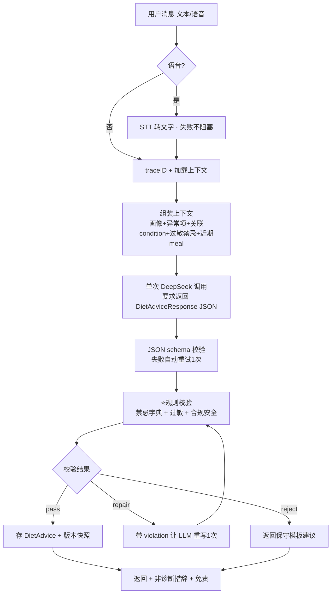

# 健康管理 Agent — 技术设计文档

> 版本：v3.0（定稿 · 已合并 GPT-5.5 二次评审）
> 日期：2026-07-04
> 配套文档：《需求文档.md》（做什么/为谁做）
> 本文件：怎么做（架构、模块、数据、Agent 编排、并发、演进）
> 评审：v2.0 初稿经 GPT-5.5 资深架构师视角评审，核心修订=**收敛 P0 控制面**（砍掉过重 DDD、砍掉伪规则闭环、砍掉 Agent tool loop）。评审全记录见 §12。

---

## 0. 设计总纲

### 0.1 三层目标（对齐 PRD，别混）
1. **骨架跑通**：录入→抽取→建议→记录，端到端不报错。
2. **建议有质量**（命根子）：结合体检异常给对的建议、不推荐犯禁食物、不幻觉。
3. **生产级**：多用户/加密/稳定/合规——P1 起分层补齐。

### 0.2 技术选型（对齐 PRD 锁定项）

| 维度 | P0 选型 | 演进（P1+） | 理由 |
|---|---|---|---|
| 语言 | Go 1.23+ | 同 | 作者主场，并发/服务强 |
| LLM | DeepSeek（OpenAI 兼容） | 可插拔多模型 | PRD 锁定 |
| 语音 STT | 多模态大模型（可选入口，不阻塞主闭环） | 国内语音大模型 | PRD 锁定 |
| 存储 | SQLite | MySQL + Redis | P0 零依赖起步，快 |
| Web | net/http + chi（轻量路由） | 同 | 不引重框架 |
| 配置 | yaml + .env | 同 | 敏感项走 env |
| 日志 | log/slog（默认脱敏） | + OTel | 结构化 |

### 0.3 ⭐ P0 边界：坚决做 / 坚决不做（评审新增，最重要）

> 评审核心结论：v2.0 最大问题不是缺能力，是**没把 P0 切干净**。这一节是纪律线。

**P0 坚决做（窄闭环）：**
```
手动/文本录入体检指标 → LLM 抽取结构化草稿 → 用户确认
→ item_code 标准化 + 单位换算 + 异常判定
→ 组装(异常项+禁忌+偏好)上下文 → DeepSeek 生成结构化建议
→ 禁忌规则 + 合规安全校验 → 存建议(带版本快照) → 记录今天吃了啥
```

**P0 坚决不做（全部推迟，写下来防止手滑做进去）：**
- ❌ 完整六边形 DDD 四层 + 按 user/medical/diet 拆聚合包 → 用最小分层
- ❌ Agent 工具调用 loop（查趋势/查库/算 BMI 的多轮工具编排）→ P0 单次 LLM 调用
- ❌ 食物库 / 营养库 / 精确热量 → P1
- ❌ 通用体检文件格式兼容 → P0 只支持一种明确模板
- ❌ 熔断 / 限流 / worker pool / OTel / Redis → P1
- ❌ 完整账号鉴权体系 → P0 单用户内测/本地部署

---

## 1. 架构分层（P0 最小分层）

> 评审采纳：完整六边形/Clean Architecture 作为**长期方向**保留，但 **P0 不铺四层**。对 1-2 周 vibe coding，最大成本不是写代码，是 AI 生成后你要理解/调试/串接口——目录一多就卡在依赖注入、DTO 转换、循环引用上。

```
cmd/server            # 装配依赖、启动 HTTP、优雅关闭
internal/
  ├── http            # handler + DTO + 统一 response + traceID 中间件
  ├── service         # 用例编排：intake / advisor / meal
  ├── store           # SQLite 读写（P0 少量接口或直接 struct，先不抽细 repo）
  ├── llm             # DeepSeek client：JSON 调用 + schema 校验 + 重试
  ├── stt             # 语音转文本 adapter（可选，不阻塞文本闭环）
  ├── rules           # ⭐ 异常判定 + 禁忌规则字典 + 合规安全校验（纯函数，可单测）
  └── model           # 核心数据结构
migrations            # 建表 SQL
config
```

**P0 保留的两条纪律（这两条不砍）：**
- `rules` 层只依赖 `model`，不依赖 http/sqlite/llm → **可纯单测**（禁忌逻辑是命根子，必须有测试）。
- 表结构预留 `user_id` 字段，但代码**不**为多用户引入完整 auth/middleware/context-user（P1 再加，零改表）。

> 评审采纳：不过早抽 repo 接口。P0 真正高频变化的不是 DB，是**领域模型 / 抽取 schema / 指标字典 / 规则结构**，过早抽接口会在实体没稳定时被锁死。P0 一个 `HealthStore` 足够，MySQL/多用户真开始时再抽细。

---

## 2. 领域模型（核心）

### 2.1 数据结构
```
Profile          静态画像：性别、生日、身高、过敏源[]、疾病史[]、饮食偏好、减肥目标
BodyMetric[]     ⭐时间序列：{type, value, unit, measured_at, source} 体重/体脂率/腰围
MedicalRecord[]  一次体检
  └── LabResult[]  {item_code, value(canonical), unit, ref_low, ref_high, ref_source, abnormal_flag}
DietAdvice[]     建议历史：{advice_json, based_on_snapshot, model, prompt_version, rules_version, created_at}
MealLog[]        吃了啥记录：{raw_text, source(text/voice), items?, at}
IntakeDraft[]    ⭐抽取草稿：{draft_id, raw_text, extracted_json, status, created_at}
```

### 2.2 关键设计
- **身体指标做时间序列不做单值**：饮食建议的价值在"趋势"（近月胖 3kg vs 稳定）。单值丢历史、无法回溯"建议基于什么数据"。
- **异常判定录入时算好落库**（`abnormal_flag`）：读多写少，不每次查询重算。
- **DietAdvice 存版本快照**（评审采纳）：记录 `based_on_snapshot`（当时基于哪些异常指标）+ `model` + `prompt_version` + `rules_version`。AI 产品最容易返工的点就是 prompt/规则一改历史结果不可解释——版本必须落库。

### 2.3 ⭐ 指标标准化字典（评审新增，最会返工的点）
自由文本抽取会出现"空腹血糖 / FPG / 葡萄糖 / GLU"多个名字，不标准化则异常判定/趋势/建议关联全乱。P0 先建**最小指标字典**（内置 map 或 `metrics.yaml`），覆盖血糖、血脂（LDL/HDL/甘油三酯）、尿酸、体重/BMI：

```yaml
fasting_glucose:
  names: ["空腹血糖", "FPG", "葡萄糖", "GLU"]
  canonical_unit: "mmol/L"
  unit_conversions: { "mg/dL": 0.0555 }     # mg/dL × 0.0555 = mmol/L
  default_ref: { low: 3.9, high: 6.1 }
  critical: { high: 16.7 }                   # 命中→提示就医，不发挥饮食建议
  condition: glucose_control
```

- **单位换算必须做**（评审采纳）：血糖 mmol/L vs mg/dL、尿酸 μmol/L vs mg/dL 不换算，异常判定直接错。按 `item_code` 存 canonical unit，不支持的单位要求用户确认。
- **参考区间优先级**：优先用报告原始区间；缺失时用字典默认区间并标 `ref_source=system_default`，不假装权威。
- **异常项→健康状况映射**：`lab_code + abnormal_flag → condition`（如 `fasting_glucose high → glucose_control`），驱动后续规则。

---

## 3. Agent 核心：从对话到饮食建议

### 3.1 P0 每日建议流水线（评审采纳：单次调用，非 tool loop）



### 3.2 降幻觉的双层结构（命根子，评审重构）

> LLM 生成（不可信） + 规则校验（可信）= 把不可信 AI 用可信后端兜住。
> **评审修正的核心漏洞**：v2.0 想"用食物库做确定性过滤"，但 P0 又没食物库 → 规则引擎空转，等于还是信 LLM。P0 的可信来源不是营养库，是**禁忌规则字典**。

**① 约束 LLM 输出为结构化 JSON**（不自由发挥）：
```jsonc
// DietAdviceResponse（P0 先定这一个稳定 schema，字段少但稳）
{
  "meals": [ { "slot": "早/午/晚", "suggestion": "低GI主食+高纤蔬菜+优质蛋白 的组合描述",
               "tags": ["low_gi","high_fiber"], "example_foods": ["燕麦","西兰花"] } ],
  "avoid": ["含糖饮料","动物内脏"],
  "reason": "关联到哪个异常指标/目标",
  "tags": ["glucose_control"]
}
```
- 评审采纳：**P0 输出以"餐盘组合/类别"为主，不强行输出精确食物清单**。没食物库时越具体越容易踩禁忌（如给海鲜过敏者推"三文鱼"）。`example_foods` 必须过禁忌关键词扫描。

**② 规则校验三档结果**（评审采纳，不是简单"剔除"）：
| 结果 | 触发 | 动作 |
|---|---|---|
| `pass` | 无禁忌命中 | 直接采用 |
| `repair` | 命中禁忌/过敏 | 带 violation 让 LLM **重写1次** |
| `reject` | 重写仍失败 / 命中 critical | 返回**保守模板建议** + 提示就医 |

**③ P0 禁忌规则字典**（评审新增，规则引擎的 ground truth）：
```yaml
conditions:
  glucose_control:
    trigger: { lab_codes: ["fasting_glucose","hba1c"], abnormal: ["high"] }
    avoid_tags: ["high_sugar","sugary_drink","dessert"]
    limit_tags: ["refined_carb"]
    recommend_tags: ["low_gi","high_fiber","lean_protein"]
    avoid_keywords: ["奶茶","甜点","蛋糕","含糖饮料","白粥"]
    safety_note: "关注控糖，避免高糖和大量精制主食"
  uric_acid_control:
    trigger: { lab_codes: ["uric_acid"], abnormal: ["high"] }
    avoid_tags: ["high_purine","alcohol","organ_meat","seafood","thick_broth"]
    recommend_tags: ["low_purine","hydration"]
    avoid_keywords: ["动物内脏","啤酒","海鲜","浓肉汤","火锅汤"]
```
+ 用户**过敏源**独立于疾病规则，永远硬过滤（如海鲜过敏 → `avoid_keywords` 注入"海鲜/虾/蟹/贝"）。

**④ RAG（P1+ 可选）**：权威膳食指南做向量库，检索增强，进一步降幻觉。

### 3.3 ⭐ 合规安全后处理（评审新增，比免责声明更硬）
免责声明是最后一层，不是合规本身。P0 加 `SafetyValidator`（rules 层，纯函数）：
| 约束 | 动作 |
|---|---|
| 禁止诊断 | 输出扫描"你患有/确诊/诊断为" → 命中重写/拒绝 |
| 禁止处方 | 禁止药物剂量/停药/换药建议 |
| 严重异常升级 | 命中字典 `critical` 范围 → 提示尽快就医/复查，不发挥饮食建议 |
| 强制非诊断措辞 | "从生活方式角度""建议关注""不能替代医生" |

### 3.4 上下文组装
喂给 LLM = `system prompt(角色+安全约束+非诊断)` + `画像摘要` + `异常指标(只挑异常+关联项)` + `过敏/禁忌` + `减肥目标` + `最近 N 轮 + 近期 meal`。摘要而非全量，省 token、聚焦。

### 3.5 数据录入（PRD P0-①，评审采纳分级）
按风险分三级，不是所有输入都两步确认：
| 输入类型 | P0 处理 |
|---|---|
| 体检报告/关键指标 | LLM 抽取 → **草稿(draft_id)** → 用户确认 → 标准化+换算+异常判定 → 落库 |
| 体重/腰围/体脂 | 抽取后直接落库，返回可编辑结果 |
| 吃了啥记录 | 直接存 `raw_text`，P0 不强抽结构化 items |

- **抽取 schema `ExtractedHealthData` 带证据**：每个字段附 `source_span`(从哪句抽的) + `confidence` + `needs_review`，低置信度默认不落库。
- **草稿态 + 幂等**（评审新增）：`intake_drafts` 表存 pending 抽取，confirm 用 `draft_id` 幂等落库，解决刷新/重复提交/确认的是哪一次。
- **结构化文件只支持一种明确模板**（评审采纳）：不承诺通用体检文件导入，任意报告文本走 LLM 抽取。

---

## 4. 数据存储

### 4.1 P0（SQLite）主要表
```sql
profiles(user_id PK, gender, birth_date, height_cm,
         allergies_json, diseases_json, diet_pref_json, weight_goal_json, updated_at)
body_metrics(id PK, user_id, metric_type, value, unit, measured_at, source)
medical_records(id PK, user_id, hospital, checked_at)
lab_results(id PK, record_id, item_code, value, unit, ref_low, ref_high, ref_source, abnormal_flag)
intake_drafts(id PK, user_id, raw_text, extracted_json, status, created_at)   -- 草稿态
diet_advices(id PK, user_id, advice_json, based_on_snapshot_json,
             model, prompt_version, rules_version, created_at)                -- 版本快照
meal_logs(id PK, user_id, raw_text, source, items_json, logged_at)
-- P1: users / audit_logs / foods / 敏感字段加密
```
> P0 单用户：`user_id` 先固定常量，表已带字段，P1 加账号零改表。

### 4.2 P0 就要做的安全（评审上调，不再全推 P1）
- **日志脱敏（P0 必做）**：默认**不打印** raw_text / 完整 prompt / 健康数值。调试用本地 debug 开关，明确不可线上开。AI 调试时最容易把体检原文打进日志。
- **最小删除能力（P0 必做）**：真实处理健康数据，至少提供"清空个人数据"接口（不一定做账号注销）。
- 字段级加密 / 审计表 / 完整注销：P1（加账号时一并做）。

---

## 5. 并发与高可用

> P0 只做最小防护，其余明确 P1。

- **超时**（P0 必做）：每次 LLM/STT 调用带 `context.WithTimeout` + HTTP server timeout，别挂死 goroutine。
- **JSON 重试**（P0 必做）：LLM 返回非法 JSON/缺字段/类型错 → 自动重试1次 → 仍失败返回可恢复错误。
- **优雅关闭**（P0 做最小版）：`srv.Shutdown(ctx)` 停新请求等在途。把 emotional-rag-agent 的"假优雅关闭"做对。
- **熔断降级 / 限流 / worker pool 批量 / OTel**（P1）：LLM 抖动降级到规则模板；夜间批量预生成用 worker pool + errgroup 按 user_id 分片（同用户串行、不同用户并行）。

---

## 6. API（P0）

| Method | Path | 说明 |
|---|---|---|
| GET | `/health` | 探活 |
| POST | `/api/v1/intake/file` | 上传结构化文件（单一模板 CSV/JSON） |
| POST | `/api/v1/intake/text` | 自由文本抽取 → 返回 `draft_id` + 抽取结果 |
| POST | `/api/v1/intake/voice` | 语音 → STT → 抽取（可选，失败不阻塞） |
| POST | `/api/v1/intake/confirm` | 按 `draft_id` 幂等确认落库 |
| GET | `/api/v1/dashboard` | 画像 + 指标趋势 + 异常项 |
| POST | `/api/v1/chat` | ⭐ 对话拿饮食建议 |
| POST | `/api/v1/meals` | 记录吃了啥（直接落库） |
| GET | `/api/v1/advices` | 历史建议 |
| DELETE | `/api/v1/me/data` | 清空个人数据（P0 最小删除能力） |

- 统一响应 `{code, message, data, trace_id}`。
- P0 无鉴权（**明确定位=单用户内测/本地部署**）；给几十人真实使用前，账号隔离+最小鉴权不能再推 P1。
- `/chat` P0 普通 JSON；P1 可升 SSE 流式。

---

## 7. 可观测性
- `log/slog` 结构化，每条带 `trace_id`，**健康数值默认脱敏**。
- traceID 贯穿 handler→service→LLM→store。
- 指标（P1）：LLM 耗时/失败率/token、熔断状态、endpoint P99。

---

## 8. 分阶段落地

| 阶段 | 内容 | 交付标志 |
|---|---|---|
| **Phase 0 骨架** | 最小分层脚手架 + config + logger(脱敏) + 优雅关闭 + `/health` + SQLite migration | 服务起得来、探活通 |
| **Phase 1 录入闭环** | 单模板文件解析 + 自由文本 LLM 抽取(带证据/草稿) + 指标字典标准化 + 单位换算 + 异常判定 | 体检文本→带异常标记的结构化数据，脏值被拦 |
| **Phase 2 建议闭环** ⭐ | 上下文组装 + 单次 LLM + JSON 校验 + 禁忌字典 + 合规安全校验 + meal 记录 | 血糖高+海鲜过敏用户，建议不含高糖/海鲜、有理由、命中 critical 提示就医 |
| **Phase 3 生产加固** | 账号鉴权 + 加密 + 审计 + 熔断限流 + Redis 会话 + 批量并发 | 多用户可用、扛抖动 |
| **Phase 4 增强** | 营养数据集热量精算 + RAG + 打卡 + 千人千面 + 锻炼 | 对齐 PRD P1/P2 |

---

## 9. 与 emotional-rag-agent 的差异（为什么这次是生产级）

| 维度 | emotional-rag-agent | healthAgent |
|---|---|---|
| 用户 | 单用户 | P0 单用户内测 → P1 多用户隔离 |
| 数据 | 文本文件 | SQLite→MySQL + 加密 PHI |
| AI 输出 | 直接信任 | LLM + 禁忌字典 + 合规安全 三重校验 |
| 抽取 | 无 | 带证据/置信度/草稿确认 |
| 并发 | 后台单协程 | P0 超时 → P1 有界并发+熔断+限流 |
| 关闭 | 假优雅关闭(TODO) | 真优雅关闭 |
| 合规 | 无 | P0 日志脱敏+删除+非诊断硬约束 |

---

## 10. 风险与待定
| 项 | 状态 | 处理 |
|---|---|---|
| 营养数据集 | 待定（PRD 放 P1） | P0 输出"餐盘组合/类别"，不出精确热量/具体清单 |
| DeepSeek JSON/function calling 稳定性 | 不确定 | 优先 JSON mode，服务端**必须** schema 校验+重试，不把 function calling 作 P0 前提 |
| 多模态中文 STT 成本/延迟/准确率 | 被低估 | 降级为可选入口，不阻塞文本闭环；先定 `STTProvider` 接口，验收以文本为主 |
| LLM 抽取错数据 | 已识别 | 数值范围校验 + 证据/置信度 + 草稿确认再落库 |
| 禁忌规则知识来源 | 需人工整理 | P0 先覆盖高频（糖尿病/痛风/高血脂），字典化逐步扩充 |
| item_code/单位不统一 | 已识别（高返工风险） | P0 建最小指标字典 + 单位换算 |

---

## 11. 待定选型（开工前定一个即可，不阻塞骨架）
1. STT 具体供应商/模型（先接最容易跑通的，接口隔离）。
2. 结构化文件的那一种模板具体字段（跟你现有体脂秤/体检 App 导出对齐）。
3. 禁忌规则字典 P0 覆盖哪几个 condition（建议：控糖、控尿酸、控血脂、减重四个起步）。

---

## 12. 评审结论与讨论记录（GPT-5.5 二次评审）

**评审判断**：v2.0 长期方向对（单用户/SQLite/DeepSeek/结构化抽取/规则兜底），但把"生产级理想态"和"1-2 周 P0"混在一起，最大风险=**P0 会被架构+Agent loop+规则引擎+语音+多入口录入一起拖死**。

**采纳的修订（已合并进本稿）：**
| # | 评审意见 | 严重度 | 本稿处理 |
|---|---|---|---|
| 1 | 六边形四层过重 | 高 | §1 改最小分层，DDD 降为长期方向 |
| 2 | 过早抽 repo 接口 | 中 | §1 P0 用单一 `HealthStore` |
| 3 | Agent tool loop 无必要 | 高 | §3.1 改单次 LLM 调用 |
| 4 | 无食物库却做规则强过滤=空转 | 高 | §3.2 改为禁忌规则字典做 ground truth |
| 5 | 规则只"剔除"不够 | 高 | §3.2 三档结果 pass/repair/reject |
| 6 | P0 应输出类别而非具体食物 | 高 | §3.2 输出餐盘组合，example_foods 过关键词扫描 |
| 7 | item_code 标准化字典缺失 | 高 | §2.3 新增最小指标字典 |
| 8 | 单位换算缺失 | 高 | §2.3 新增单位换算 |
| 9 | intake 草稿态/幂等缺失 | 高 | §3.5 + §4.1 新增 intake_drafts + draft_id 幂等 |
| 10 | 抽取缺证据/置信度 | 中 | §3.5 schema 加 source_span/confidence |
| 11 | 录入分级（不都两步确认） | 中 | §3.5 三级分流 |
| 12 | DeepSeek JSON/function calling 想当然 | 高 | §5 + §10 服务端强制 schema 校验+重试 |
| 13 | 多模态 STT 风险低估 | 高 | §10 降级为可选入口 |
| 14 | 合规只靠免责声明不够 | 高 | §3.3 新增 SafetyValidator + critical 升级 |
| 15 | 日志脱敏/删除应 P0 | 高 | §4.2 上调为 P0 必做 |
| 16 | prompt/rules 版本管理缺失 | 高 | §2.2 DietAdvice 存版本快照 |
| 17 | 真实几十用户 vs P0无鉴权冲突 | 中 | §6 明确 P0=单用户内测/本地 |

**保留未采纳/降级项：** 熔断/OTel/worker pool 评审同意放 P1（本稿一致）。

**最终结论（双方一致）**：按本 v3.0 裁剪后的窄闭环，**1-2 周 P0 有机会跑通**；若按 v2.0 完整四层+tool loop+语音+通用文件解析一起做，时间会被架构和边界条件吃掉，核心价值反而晚出来。
```
